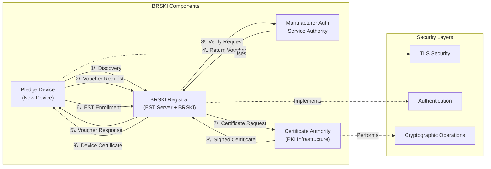

# BRSKI Components

```mermaid
flowchart LR
    %% BRSKI Components
    subgraph "BRSKI Components"
        direction LR

        Pledge["Pledge Device<br>(New Device)"]
        Registrar["BRSKI Registrar<br>(EST Server + BRSKI)"]
        MASA["Manufacturer Auth<br>Service Authority"]
        CA["Certificate Authority<br>(PKI Infrastructure)"]

        Pledge -->|1\. Discovery| Registrar
        Pledge -->|2\. Voucher Request| Registrar
        Registrar -->|3\. Verify Request| MASA
        MASA -->|4\. Return Voucher| Registrar
        Registrar -->|5\. Voucher Response| Pledge

        Pledge -->|6\. EST Enrollment| Registrar
        Registrar -->|7\. Certificate Request| CA
        CA -->|8\. Signed Certificate| Registrar
        Registrar -->|9\. Device Certificate| Pledge
    end

    %% Security Layers
    subgraph "Security Layers"
        direction TB
        TLS["TLS Security"]
        Auth["Authentication"]
        Crypto["Cryptographic Operations"]
    end

    Pledge -.->|"Uses"| TLS
    Registrar -.->|"Implements"| Auth
    CA -.->|"Performs"| Crypto
```