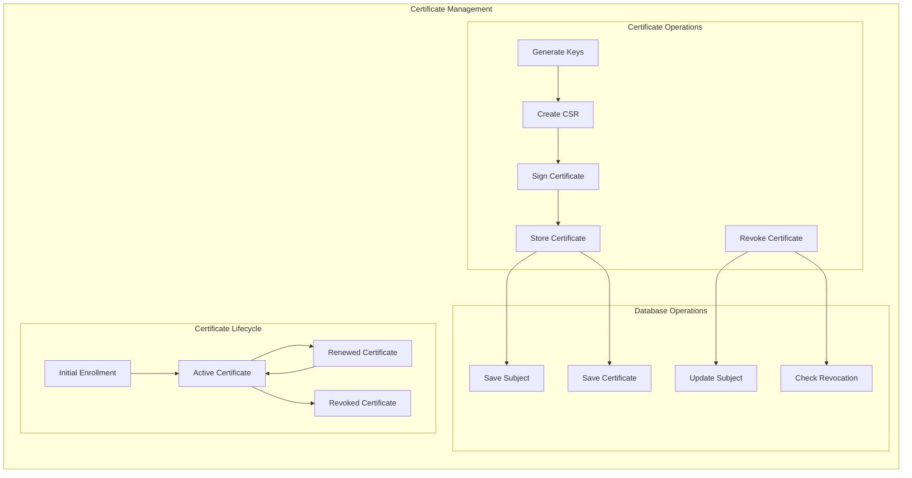

# Certificate Management

```mermaid
flowchart TD
    subgraph "Certificate Management"
        direction TB
        
        subgraph "Certificate Operations"
            GenKey["Generate Keys"]
            CreateCSR["Create CSR"]
            SignCert["Sign Certificate"]
            StoreCert["Store Certificate"]
            RevokeCert["Revoke Certificate"]
        end
        
        subgraph "Database Operations"
            SaveSubject["Save Subject"]
            UpdateSubject["Update Subject"]
            SaveCert["Save Certificate"]
            CheckRevocation["Check Revocation"]
        end
        
        GenKey --> CreateCSR
        CreateCSR --> SignCert
        SignCert --> StoreCert
        
        StoreCert --> SaveSubject
        StoreCert --> SaveCert
        
        RevokeCert --> UpdateSubject
        RevokeCert --> CheckRevocation
        
        subgraph "Certificate Lifecycle"
            Initial["Initial Enrollment"]
            Active["Active Certificate"]
            Renewed["Renewed Certificate"]
            Revoked["Revoked Certificate"]
            
            Initial --> Active
            Active --> Renewed
            Active --> Revoked
            Renewed --> Active
        end
    end
```