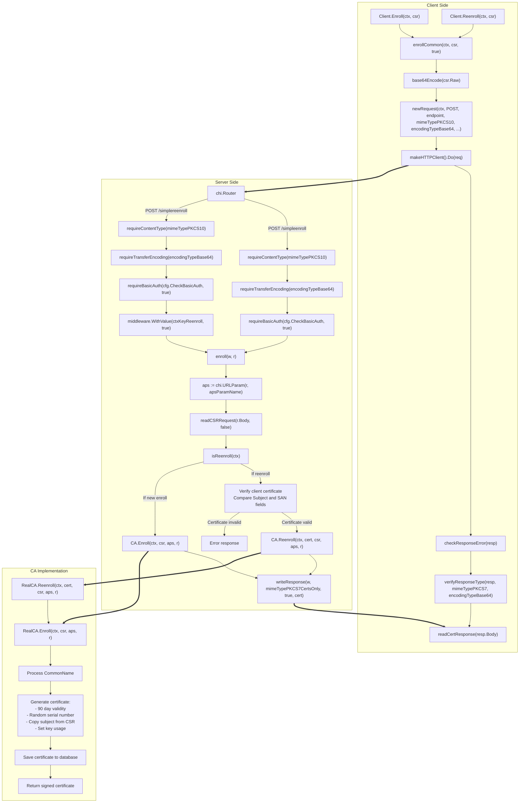

# Enrollment

```mermaid
flowchart TD
    %% Client side
    subgraph "Client Side"
        clientEnroll["Client.Enroll(ctx, csr)"]
        clientReenroll["Client.Reenroll(ctx, csr)"]
        
        clientEnroll --> enrollCommon["enrollCommon(ctx, csr, false)"]
        clientReenroll --> enrollCommon["enrollCommon(ctx, csr, true)"]
        
        enrollCommon --> encodeCSR["base64Encode(csr.Raw)"]
        encodeCSR --> createReq["newRequest(ctx, POST, endpoint, mimeTypePKCS10, encodingTypeBase64, ...)"]
        createReq --> sendReq["makeHTTPClient().Do(req)"]
        sendReq --> checkResp["checkResponseError(resp)"]
        checkResp --> verifyRespType["verifyResponseType(resp, mimeTypePKCS7, encodingTypeBase64)"]
        verifyRespType --> readCertResp["readCertResponse(resp.Body)"]
    end
    
    %% Server side
    subgraph "Server Side"
        serverRouter["chi.Router"]
        
        serverRouter -->|"POST /simpleenroll"| midContent1["requireContentType(mimeTypePKCS10)"]
        serverRouter -->|"POST /simplereenroll"| midContent2["requireContentType(mimeTypePKCS10)"]
        
        midContent1 --> midEncoding1["requireTransferEncoding(encodingTypeBase64)"]
        midContent2 --> midEncoding2["requireTransferEncoding(encodingTypeBase64)"]
        
        midEncoding1 --> midAuth1["requireBasicAuth(cfg.CheckBasicAuth, true)"]
        midEncoding2 --> midAuth2["requireBasicAuth(cfg.CheckBasicAuth, true)"]
        
        midAuth1 --> enroll["enroll(w, r)"]
        midAuth2 --> reenrollMiddleware["middleware.WithValue(ctxKeyReenroll, true)"]
        reenrollMiddleware --> enroll
        
        enroll --> getAPS["aps := chi.URLParam(r, apsParamName)"]
        getAPS --> parseCSR["readCSRRequest(r.Body, false)"]
        parseCSR --> checkEnrollType["isReenroll(ctx)"]
        
        checkEnrollType -->|"If reenroll"| verifyCertificate["Verify client certificate<br>Compare Subject and SAN fields"]
        checkEnrollType -->|"If new enroll"| caEnroll["CA.Enroll(ctx, csr, aps, r)"]
        
        verifyCertificate -->|"Certificate valid"| caReenroll["CA.Reenroll(ctx, cert, csr, aps, r)"]
        verifyCertificate -->|"Certificate invalid"| returnErr["Error response"]
        
        caEnroll --> writeResp["writeResponse(w, mimeTypePKCS7CertsOnly, true, cert)"]
        caReenroll --> writeResp
    end
    
    %% CA implementation
    subgraph "CA Implementation"
        realCAEnroll["RealCA.Enroll(ctx, csr, aps, r)"]
        realCAReenroll["RealCA.Reenroll(ctx, cert, csr, aps, r)"]
        
        realCAReenroll --> realCAEnroll
        
        realCAEnroll --> processCN["Process CommonName"]
        processCN --> generateCert["Generate certificate:<br>- 90 day validity<br>- Random serial number<br>- Copy subject from CSR<br>- Set key usage"]
        generateCert --> saveCert["Save certificate to database"]
        saveCert --> returnCert["Return signed certificate"]
    end
    
    %% Connect the components
    sendReq ==> serverRouter
    writeResp ==> readCertResp
    caEnroll ==> realCAEnroll
    caReenroll ==> realCAReenroll
```