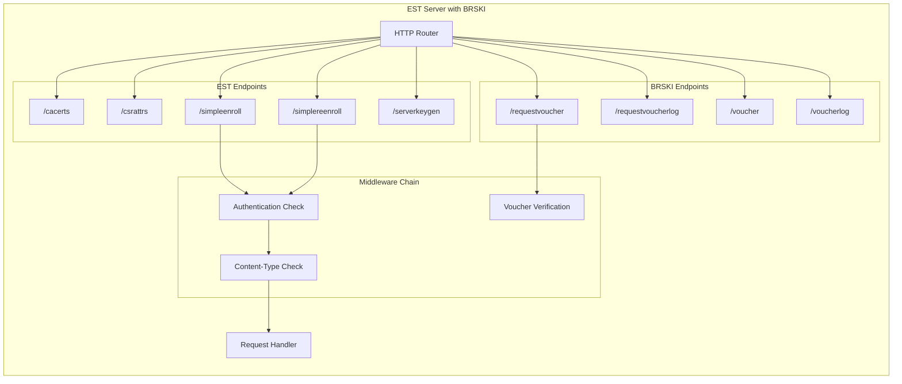

# EST Server with BRSKI

```mermaid
flowchart TD
    subgraph "EST Server with BRSKI"
        direction TB
        
        Router["HTTP Router"]
        
        subgraph "EST Endpoints"
            cacerts["/cacerts"]
            csrattrs["/csrattrs"]
            enroll["/simpleenroll"]
            reenroll["/simplereenroll"]
            serverkeygen["/serverkeygen"]
        end
        
        subgraph "BRSKI Endpoints"
            requestvoucher["/requestvoucher"]
            requestvoucherlog["/requestvoucherlog"]
            voucher["/voucher"]
            voucherlog["/voucherlog"]
        end
        
        subgraph "Middleware Chain"
            direction LR
            AuthCheck["Authentication Check"]
            ContentCheck["Content-Type Check"]
            VoucherCheck["Voucher Verification"]
        end
        
        Router --> cacerts
        Router --> csrattrs
        Router --> enroll
        Router --> reenroll
        Router --> serverkeygen
        
        Router --> requestvoucher
        Router --> requestvoucherlog
        Router --> voucher
        Router --> voucherlog
        
        enroll --> AuthCheck
        reenroll --> AuthCheck
        requestvoucher --> VoucherCheck
        
        AuthCheck --> ContentCheck
        ContentCheck --> Handler["Request Handler"]
    end
```
