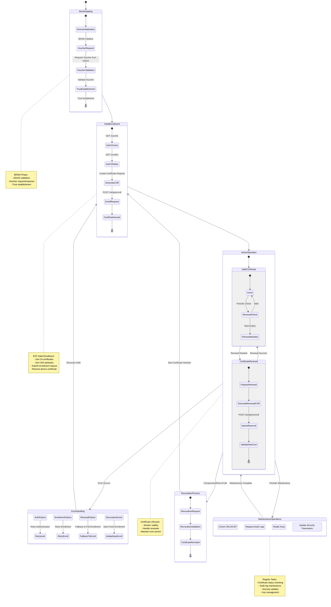

# Lifecycle Management

```mermaid
stateDiagram-v2
    [*] --> Bootstrapping

    state Bootstrapping {
        [*] --> DeviceInitialization
        DeviceInitialization --> VoucherRequest: BRSKI Initialize
        VoucherRequest --> VoucherValidation: Request Voucher from MASA
        VoucherValidation --> TrustEstablishment: Validate Voucher
        TrustEstablishment --> [*]: Trust Established
    }

    Bootstrapping --> InitialEnrollment

    state InitialEnrollment {
        [*] --> GetCACerts: GET /cacerts
        GetCACerts --> GetCSRAttrs: GET /csrattrs
        GetCSRAttrs --> GenerateCSR: Create Certificate Request
        GenerateCSR --> EnrollRequest: POST /simpleenroll
        EnrollRequest --> CertificateIssued
        CertificateIssued --> [*]
    }

    InitialEnrollment --> ActiveOperation

    state ActiveOperation {
        [*] --> ValidCertificate
        
        state ValidCertificate {
            [*] --> InUse
            InUse --> RenewalCheck: Periodic Check
            RenewalCheck --> InUse: Valid
            RenewalCheck --> RenewalNeeded: Near Expiry
        }

        ValidCertificate --> CertificateRenewal: Renewal Needed
        
        state CertificateRenewal {
            [*] --> PrepareRenewal
            PrepareRenewal --> GenerateRenewalCSR
            GenerateRenewalCSR --> SubmitReenroll: POST /simplereenroll
            SubmitReenroll --> ValidateNewCert
            ValidateNewCert --> [*]
        }

        CertificateRenewal --> ValidCertificate: Renewal Success
    }

    state ErrorHandling {
        AuthFailure --> RetryAuth: Retry Authentication
        EnrollmentFailure --> RetryEnroll: Retry Enrollment
        RenewalFailure --> FallbackToEnroll: Fallback to Full Enrollment
        RevocationEvent --> InitiateNewEnroll: Start Fresh Enrollment
    }

    ActiveOperation --> ErrorHandling: Error Occurs
    ErrorHandling --> InitialEnrollment: Recovery Path
    
    state MaintenanceOperations {
        RevocationCheck: Check CRL/OCSP
        AuditLogRequest: Request Audit Logs
        KeyRotation: Rotate Keys
        SecurityUpdate: Update Security Parameters
    }

    ActiveOperation --> MaintenanceOperations: Periodic Maintenance
    MaintenanceOperations --> ActiveOperation: Maintenance Complete

    state RevocationProcess {
        [*] --> RevocationRequest
        RevocationRequest --> RevocationValidation
        RevocationValidation --> CertificateRevoked
        CertificateRevoked --> [*]
    }

    ActiveOperation --> RevocationProcess: Compromise/End-of-Life
    RevocationProcess --> InitialEnrollment: New Certificate Needed

    note right of Bootstrapping
        BRSKI Phase:
        - IDevID validation
        - Voucher request/response
        - Trust establishment
    end note

    note right of InitialEnrollment
        EST Initial Enrollment:
        - Get CA certificates
        - Get CSR attributes
        - Submit enrollment request
        - Receive device certificate
    end note

    note right of ActiveOperation
        Certificate Lifecycle:
        - Monitor validity
        - Handle renewals
        - Maintain trust anchor
    end note

    note right of MaintenanceOperations
        Regular Tasks:
        - Certificate status checking
        - Audit log maintenance
        - Security updates
        - Key management
    end note
```
