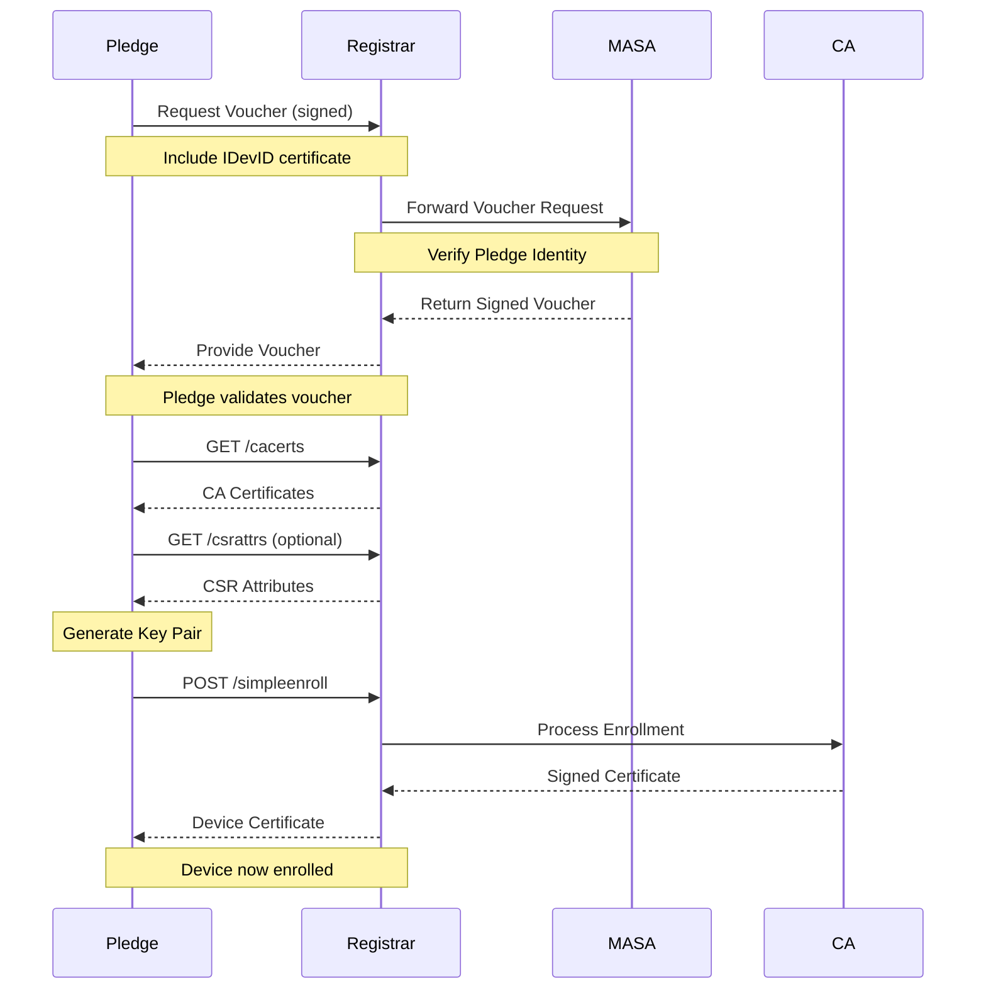

# Pledge Enrollment

```mermaid
sequenceDiagram
    participant P as Pledge
    participant R as Registrar
    participant M as MASA
    participant C as CA

    P->>R: Request Voucher (signed)
    Note over P,R: Include IDevID certificate
    R->>M: Forward Voucher Request
    Note over R,M: Verify Pledge Identity
    M-->>R: Return Signed Voucher
    R-->>P: Provide Voucher
    
    Note over P,R: Pledge validates voucher
    P->>R: GET /cacerts
    R-->>P: CA Certificates
    
    P->>R: GET /csrattrs (optional)
    R-->>P: CSR Attributes
    
    Note over P: Generate Key Pair
    P->>R: POST /simpleenroll
    R->>C: Process Enrollment
    C-->>R: Signed Certificate
    R-->>P: Device Certificate

    Note over P,R: Device now enrolled
```
